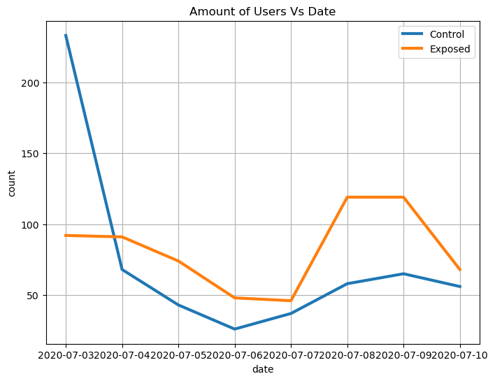

# Assessing the Impact of New Advertising Campaign vs Old Campaign: An A/B testing Portfolio Project
Dataset source from Kaggle: https://www.kaggle.com/datasets/osuolaleemmanuel/ad-ab-testing/data

# Overview 
Advertising plays a pivotal role in any business, contributing significantly to its success. While the creation of new advertisements is a common practice, it is important to note that the effectiveness of an ad is not solely determined by its novelty. To make informed decisions regarding advertising strategies, conducting research, such as A/B testing, is essential.

The dataset contains information related to auction_id, experiment, date, hour, browser, device, operating system(OS), and response. This data is utilized for research purposes to assess whether a company should implement a new ad design to enhance its performance.

## Experiment Approach
The objective of this study is to analyze the outcomes of the A/B test and determine the optimal advertising strategy. It aims to assess how such a strategy might impact customer behavior, specifically their responses to the BIO questionnaire.

- **Null Hypothesis H<sub>o</sub>: p = p<sub>o</sub>** - There is no statistically significant difference in the success rate of the advertising strategy of the two groups.
- **Alternative Hypothesis H<sub>a</sub>: p &ne; p<sub>o</sub>** - There is a statistically significant difference in the success rate of the advertising strategies between the two groups. It is important to note that we are not making any assumptions about whether the new design will perform better, worse, or equally to the current design, we are simply conducting two tests to explore the differences.
- **Confidence Level:** 95% (α=0.05).
- In this context **p** and **p<sub>o</sub>** represents the conversion rate of the new and old design in the advertising strategy.

## Data description
| Field         | Description                                                                   |
|---------------|-------------------------------------------------------------------------------|
| auction_id    | The unique id of the online user who has been presented the BIO. In standard terminologies, this is called an impression id. The user may see the BIO questionnaire but choose not to respond. In that case, both the 'yes' and 'no' columns are zero.  |
| experiment    | Which group the user belongs to - control or exposed.                         |
| control       | Users who have been shown a dummy ad.                                        |
| exposed       | Users who have been shown a creative, online interactive ad, with the SmartAd brand.  |
| date          | The date in YYYY-MM-DD format.                                               |
| hour          | The hour of the day in HH format.                                            |
| device_make   | The name of the type of device the user has, e.g., Samsung.                   |
| platform_os   | The id of the OS the user has.                                                |
| browser       | The name of the browser the user uses to see the BIO questionnaire.          |
| yes           | 1 if the user chooses the “Yes” radio button for the BIO questionnaire.      |
| no            | 1 if the user chooses the “No” radio button for the BIO questionnaire.       |

- Rows: 8077
- Columns: 8
- Null values: 0
- Duplicates: 0
### Exploratory Data Analysis

#### Response


|response %	|yes	|no	|no response|
|-----------|-----|---|-----------|
|experiment	|	  |     |     |
|control	|6.48	|7.91	|85.61|
|exposed	|7.69	|8.71	|83.60|

The graph illustrates that a substantial portion of the BIO questionnaires received no response, with only 14.39% in the control group and 16.40% providing answers. As a result, our analysis primarily focuses on individuals who responded to the BIO questionnaire.


| Response % |  Yes  |   No   |
|------------|-------|-------|
| Experiment |       |       |
| Control    | 45.05 | 54.95 |
| Exposed    | 46.88 | 53.12 |

Both groups now exhibit similar conversion rates.

#### Experiment


```
Percent of users in control group: 47.14%
Percent of users in exposed group: 52.86%
```
#### Date



```
First day of experiments: 2020-07-03
Last day of experiments: 2020-07-10
```

#### Hour


The graph depicts variations in hours between the two groups during experiments conducted on different days. However, there are extreme values observed for users in the control group during 15-hour period on the first day of the experiment.

#### Device


The most commonly used device in both testing groups dominated by:

- Generic Smartphone
- Samsung
- Iphone
- Nokia
- Pixel

#### Browser


| browser usage % | Samsung | Chrome | Facebook | Safari |
|-----------------|---------|--------|----------|-------|
| Experiment      |         |        |          |       |
| Control         | 15.02   | 63.65  | 19.11    | 2.22  |
| Exposed         | 8.68    | 84.02  | 6.70     | 0.61  |

The chart and table below depict the predominant browser used in both experiments, with Chrome emerging as the most commonly used browser.
```
- 63.65% for control group
- 84.02% for exposed group
```

#### Operang system(OS)


|platform_os| Size after Normalize|
|-----------|---------------------|
|6          |0.986323|
|5          |0.013677|

The preeminent operating system in both groups is OS 6.

##### Conculusion EDA

-  Approximately 83-86% of users did not respond to a questionnaire.
-  Both groups exhibited similar conversion rates with only 2% different
-  The sizes of the control and exposed groups are comparable
-  The experiment was held for a week
-  Anomalously, there were 249 users in the control group on 07-03-2020 at 15 hour, while the mean value remained at 24
-  The most frequently used devices in both the control and exposed groups are as follows:
   - Generic Smartphone
   - Samsung
   - Iphone
   - Nokia
   - Pixel
- The Chrome browser was the most popular choice for most users in both groups: 
   - 63.65% for control group
   - 84.02% for exposed group
- The majority of platforms in both groups are dominated by platform_os - 6

### Statistical Analysis

To assess whether the new advertising campaign has a significant impact on the conversion rate, we need to estimate the significance of the difference between results obtained with the old ad and the new one is significant.

#### Formulating Hypothesis

- **Null Hypothesis H<sub>o</sub>: p = p<sub>o</sub>** - There is no statistically significant difference in the success rate of the advertising strategy of the two groups.
- **Alternative Hypothesis H<sub>a</sub>: p &ne; p<sub>o</sub>** - There is a statistically significant difference in the success rate of the advertising strategies between the two groups. It is important to note that we are not making any assumptions about whether the new design will perform better, worse, or equally to the current design, we are simply conducting two tests to explore the differences.
- **Confidence Level:** 95% (α=0.05).
- In this context **p** and **p<sub>o</sub>** represents the conversion rate of the new and old design in the advertising strategy.

#### Chi-square Contingency

- Chi-square Contingency can be used to examine the association or independence between both groups.
- There are several assumptions to consider when conducting the Chi-square Contingency test:
   - Random sample - data in each group should be randomly sampled.
   - Independence - each observation should not influence other observations significantly.
   - Mutually exclusive groups - each group should be mutually exclusive.

- All of these assumptions are valid in this case:
   - The data is collected randomly without any particular bias
   - Each user's decision is independent of others.
   - Response is mutual, either 'yes' or 'no'.

##### Chi-square Homogeneity Test
###### Two-sided Test 'yes', 'no', and 'no response'

| Data          | Value                   |
|---------------|-------------------------|
|Chi-square statistic| 6.6549 |
|p-value             | 0.0359 |
|DOF                 | 2                  |
|Expected Frequencies| [[ 283.6984,  332.8000, 3389.5015 ] <br> [ 288.3016,  338.1999, 3444.4985 ]]              |

###### Two-sided Test 'yes', and 'no'
| Data          | Value                   |
|---------------|-------------------------|
|Chi-square statistic| 0.3465 |
|p-value             | 0.5561 |
|DOF                 | 1                  |
|Expected Frequencies| [[269.6637, 316.3363] <br> [302.3363, 354.6637]] |


  
